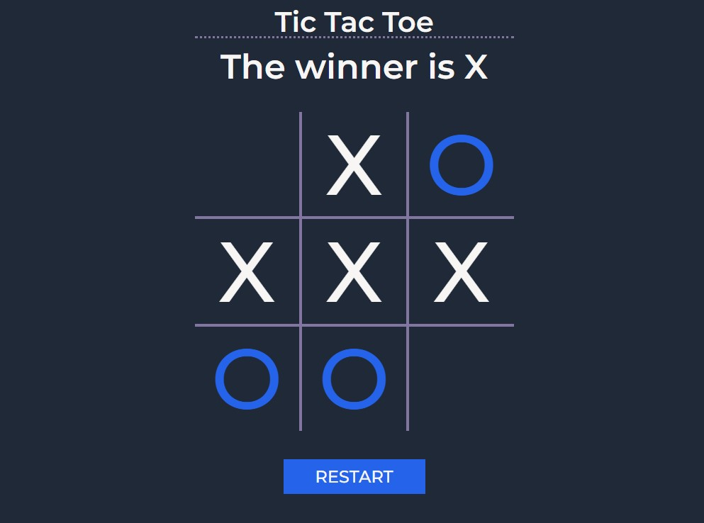

# The Odin Project - JavaScript Course

## Project: Tic Tac Toe

## [Live](https://isikava.github.io/tic-tac-toe/)

A Tic Tac Toe game you can play in your browser!

In this project, I learned how to make code cleaner by applying the module pattern, factory functions.

## Built with

- HTML, CSS and JS
- ESLint + Airbnb JavaScript Style Guide
- Prettier

## Installation

You don't need to install the app to run it locally. Just open index.html in your browser or start the live server.  
For development, if you need ESlint and Prettier, install their extensions for your editor. Then install the packages: run `npm install` in your terminal. Requires Node >= 16, npm >= 7.
